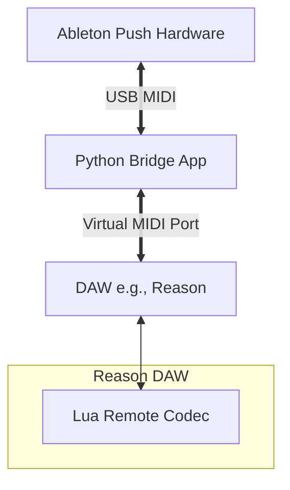

# open-push

## Project Overview

**open-push** is an open-source project designed to unlock the potential of Ableton Push hardware (specifically Push 1, with Push 2/3 planned) for use with DAWs other than Ableton Live.

The primary goal is to prevent these capable controllers from becoming e-waste by providing:
1.  **Standalone Functionality:** Using Push as a playable isomorphic MIDI instrument.
2.  **DAW Integration:** A bridge application to interface Push with DAWs like Propellerhead Reason (via Remote SDK), Logic, Bitwig, etc.

### Core Components

*   **Python Bridge:** The main application logic handling MIDI I/O, hardware control (LCD, LEDs), and protocol translation.
*   **Reason Remote Codecs (Lua):** Custom scripts that run within Reason to communicate with the Python bridge via specific MIDI messages.
*   **Virtual MIDI Ports:** Uses system-level virtual ports (IAC Driver on macOS) to route signals between the hardware, the bridge, and the DAW.

## Architecture



## Key Files & Directories

*   `src/open_push/`: Core Python package for the application.
    *   `core/hardware.py`: Handles low-level hardware interactions (pads, buttons, encoders).
    *   `core/display.py`: Manages the Push LCD display (SysEx for Push 1).
*   `src/reason/`: Specific integration logic for Propellerhead Reason.
    *   `app.py`: Main entry point for the Reason bridge application.
    *   `codecs/`: Contains Lua scripts (`.lua`, `.luacodec`) for Reason Remote.
*   `src/experiments/`: Prototype scripts and feature tests.
    *   `isomorphic_controller.py`: A functional script turning Push into an isomorphic keyboard.
*   `docs/`: Extensive documentation on protocols, hardware comparisons, and reverse-engineering findings.
    *   `00-project-overview.md`: Detailed architectural vision.
    *   `01-push-midi-protocol.md`: Reference for Push MIDI commands.

## Setup & Usage

### Prerequisites
*   **Python 3.x**
*   **Virtual MIDI Driver:** IAC Driver on macOS (no setup usually required).

### Installation

1.  **Install Python Dependencies:**
    ```bash
    pip3 install mido python-rtmidi
    ```

### Running the Isomorphic Controller (Standalone)
This mode allows you to play the Push as a standard MIDI instrument.
```bash
python3 src/experiments/isomorphic_controller.py
```
*   **In DAW:** Select "open-push" as the MIDI input device.

### Running the Reason Bridge (Planned)
*   **Status:** Implementation in progress. Basic Transport control is now aligned with Push hardware CCs. Advanced display support (SysEx) is documented but requires implementation.
*   **Install Codecs:**
    ```bash
    # (Check src/open_push/reason/codecs for the install script)
    ./src/open_push/reason/codecs/install_codecs.sh
    ```
*   **Start Bridge:**
    ```bash
    python3 src/open_push/reason/app.py
    ```
*   **Documentation:** See `docs/09-reason-integration-guide.md` for details on building remote scripts and the communication protocol.

## Development Conventions

*   **Language:** Python 3 for the app, Lua for Reason Remote codecs.
*   **MIDI Libraries:** Uses `mido` for message handling and `python-rtmidi` for backend I/O.
*   **Documentation:** Maintain detailed docs in `docs/` as hardware protocols are reverse-engineered.
*   **Testing:** Prototype new hardware interactions in `src/experiments/` before integrating into the main package.
