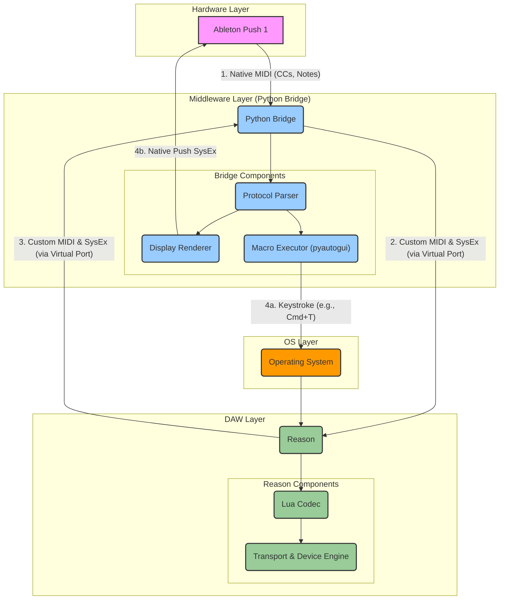

# Proposed Architecture for OpenPush

This document provides a visual representation of the proposed architecture, detailing the flow of information between the Ableton Push, the Python bridge, and Reason.

## Architecture Diagram

## Explanation of Data Flow

This architecture separates the "DAW Logic" from the "Hardware Logic".

### 1. **Controller Input (Push -> Reason)**
1.  You press a button on the **Ableton Push**. It sends a standard MIDI CC message (e.g., CC 85 for Play).
2.  The **Python Bridge** receives this message. It forwards this standard MIDI command through a Virtual MIDI Port to Reason.
3.  The **Lua Codec** inside Reason receives the CC and, using its `auto_inputs`, triggers the corresponding item (e.g., "Play"), which tells the **DAW Engine** to start playback.

### 2. **Feedback and Display Updates (Reason -> Push)**
1.  Reason's state changes (e.g., the playhead is moving, or a new track is selected).
2.  Reason calls the `remote_set_state` function in the **Lua Codec**.
3.  The Lua Codec formats this information into a custom SysEx message (e.g., `F0 00 11 22 01 40 'Track 1'... F7`) and sends it out through the Virtual MIDI Port.
4.  The **Python Bridge** receives this custom SysEx message. Its **Protocol Parser** identifies it as a display update.
5.  The **Display Renderer** in the bridge takes the text ("Track 1") and translates it into the complex, *native* SysEx format the Push 1 hardware requires, then sends it to the **Ableton Push**, updating the screen.

### 3. **Keystroke Macros (Push -> OS -> Reason)**
This is for functions Reason's Remote SDK doesn't support, like "New Track".
1.  You press the "New" button on the **Ableton Push**.
2.  The **Lua Codec** receives the corresponding CC message.
3.  Instead of mapping it to a Reason item, it sends a custom SysEx "Macro" command back to the bridge (e.g., `F0 00 11 22 01 50 01 F7`, where `01` means "New Track").
4.  The **Protocol Parser** in the bridge identifies this as a macro command.
5.  The **Macro Executor** (`pyautogui`) simulates an OS-level keystroke, such as `Cmd+T`.
6.  The **Operating System** delivers this keystroke to the focused application, which should be **Reason**.

This model ensures that the complex, hardware-specific tasks (display rendering, OS interaction) are handled in Python, while the DAW-specific state logic is handled cleanly in Lua.